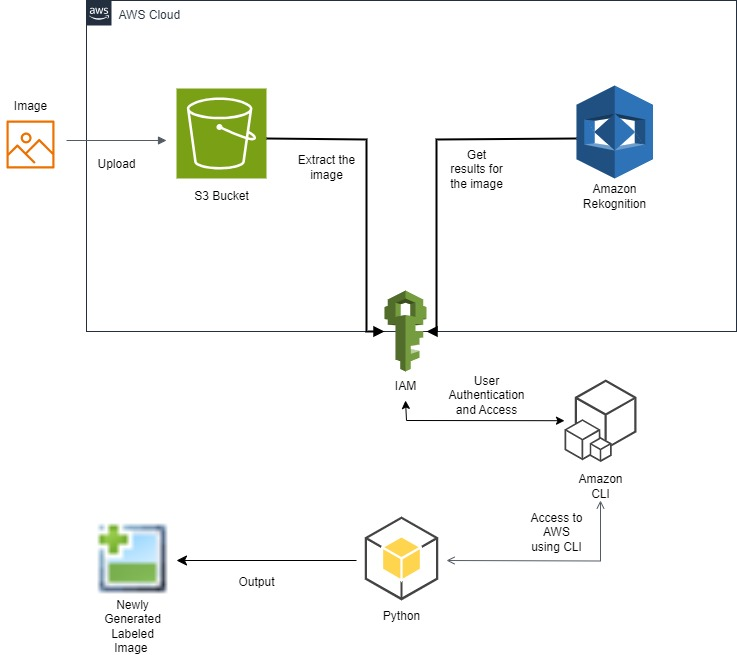
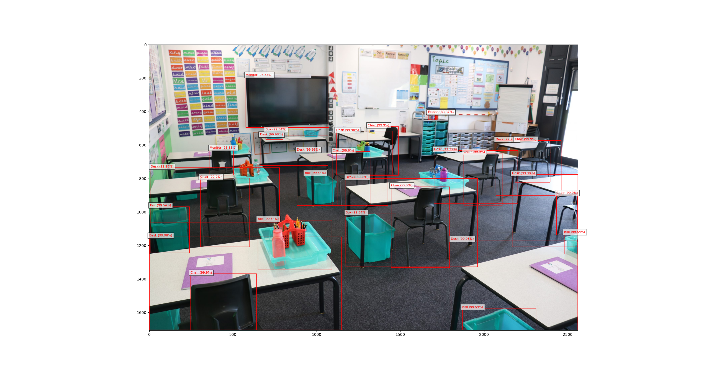

# 🖼️ Image Labels Generator using AWS Rekognition

This project demonstrates how to use **Amazon Rekognition** with an image stored in **Amazon S3** to detect objects, scenes, and concepts.  
The results include **confidence scores** and **bounding boxes** drawn on the image using **Matplotlib**.

---

## 📌 Architecture


**Workflow:**
1. Upload an image to an **Amazon S3 bucket**.  
2. **Amazon Rekognition** analyzes the image and detects labels.  
3. A Python script (`detect_labels.py`) fetches the results using **boto3**.  
4. Labels + bounding boxes are displayed using **Matplotlib**.  

---

## 🚀 Setup Instructions

### 1. Clone the repository
```bash
git clone https://github.com/<your-username>/aws-rekognition-image-labels.git
cd aws-rekognition-image-labels
```

### 2. Install dependencies
Install Python libraries:
```bash
pip install -r requirements.txt
```

If you also want AWS CLI + Jupyter for testing/documentation:
```bash
pip install -r requirements-dev.txt
```

### 3. Configure AWS credentials
Make sure you have AWS CLI configured with valid credentials:
```bash
aws configure
```
Provide your:
- AWS Access Key ID  
- AWS Secret Access Key  
- Default region (e.g., `us-east-1`)  
- Output format (e.g., `json`)  

### 4. Create an S3 bucket & upload an image
- Create a new S3 bucket in your AWS account.  
- Upload an image (e.g., `test_image.jpg`).  
- Update `detect_labels.py` with your bucket name and image file:

```python
photo = 'test_image.jpg'
bucket = 'your-bucket-name'
```

### 5. Run the script
```bash
python detect_labels.py
```

---

## 📊 Sample Output

**Image with Bounding Boxes:**


---

## 📦 Requirements

### Core (`requirements.txt`)
```
boto3
matplotlib
pillow
```

### Dev Tools (`requirements-dev.txt`)
```
awscli
jupyter
```

---

## 🔧 Technologies Used
- Amazon Rekognition  
- Amazon S3  
- AWS CLI (for configuration)  
- IAM (for authentication)  
- boto3  
- Matplotlib  
- Pillow  
- Python 3  

---

## 🔮 Future Improvements
- Build a Flask web app for uploading & analyzing images.  
- Extend detection to face recognition & moderation labels.  
- Deploy as a serverless Lambda function.  

---

## 📄 License
This project is licensed under the MIT License.
